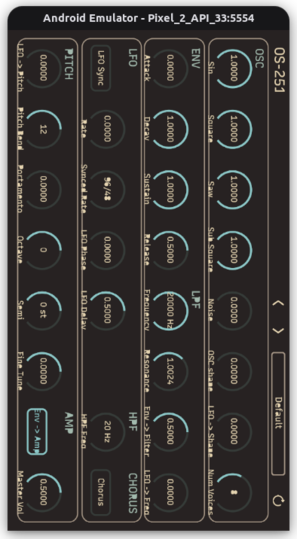
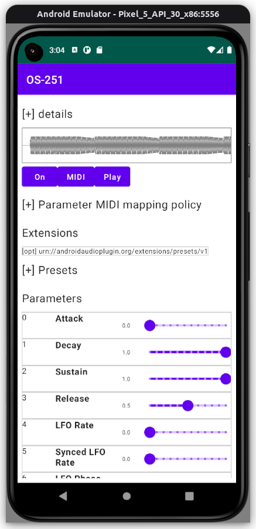
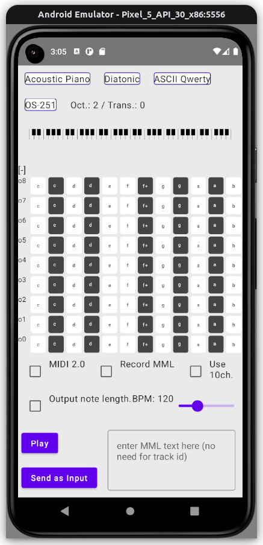

It is a port of [utokusa/OS-251](https://github.com/utokusa/OS-251) to [Audio Plugins For Android](https://github.com/atsushieno/aap-core), using [aap-juce](https://github.com/atsushieno/aap-juce).

This repository contains only a set of build scripts with almost no creative choices (which is a requirement for any copyright claims) but I leave GPLv3 license text for compatibility with OS-251, JUCE and aap-juce.

OS-251 used to be a react-juce application, but the version we reference
is not anymore, so the build is simpler now.
